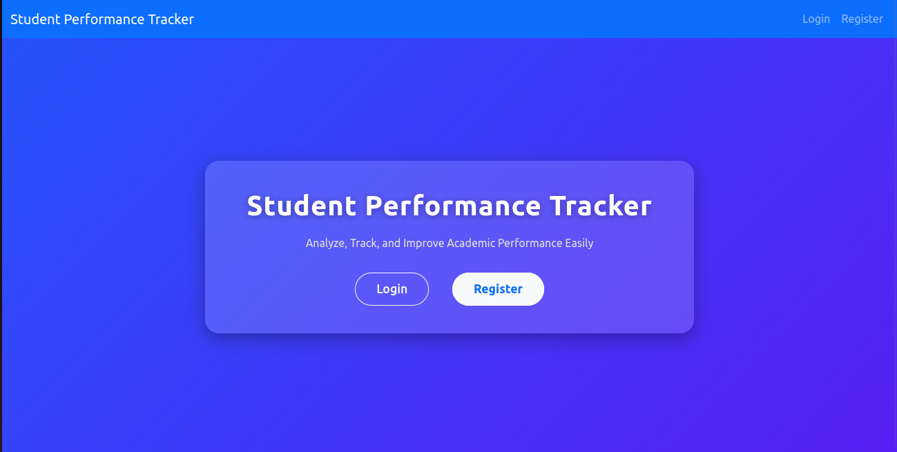
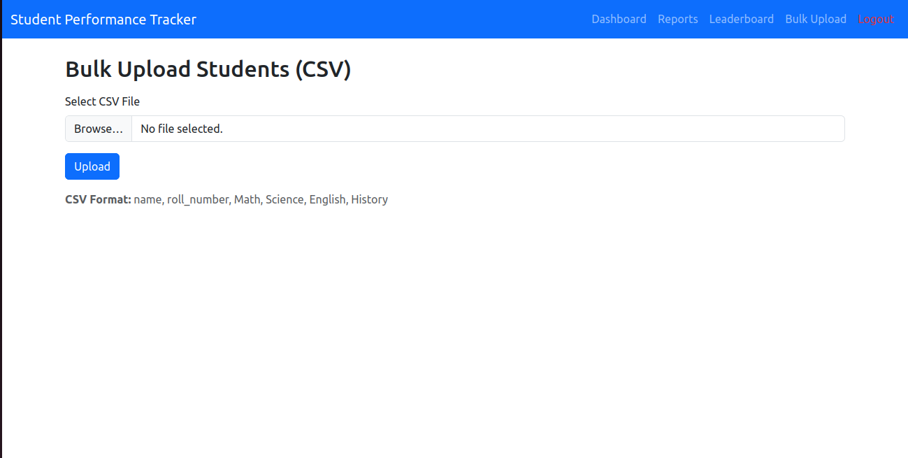
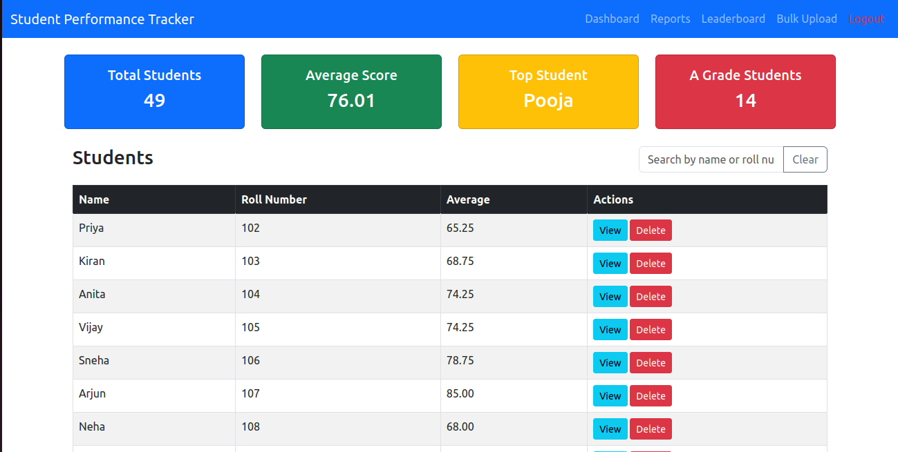
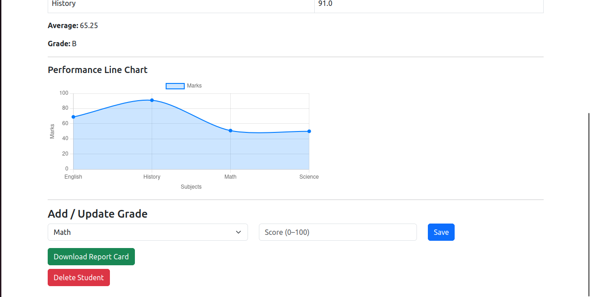
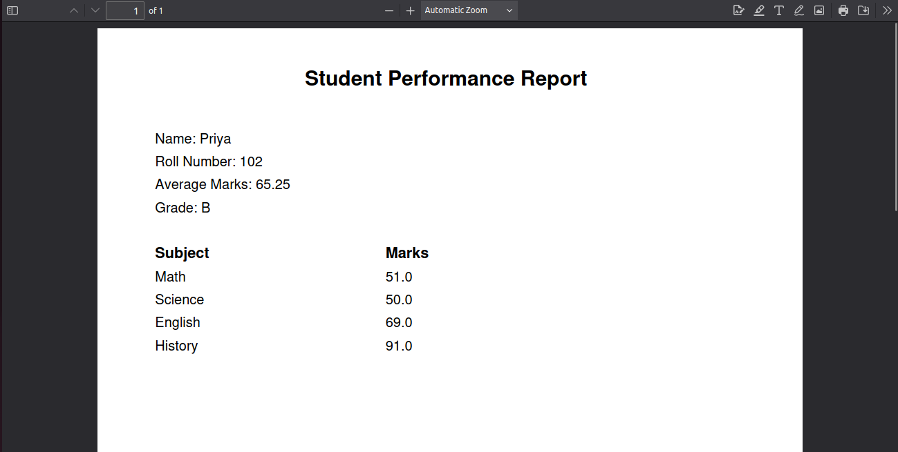
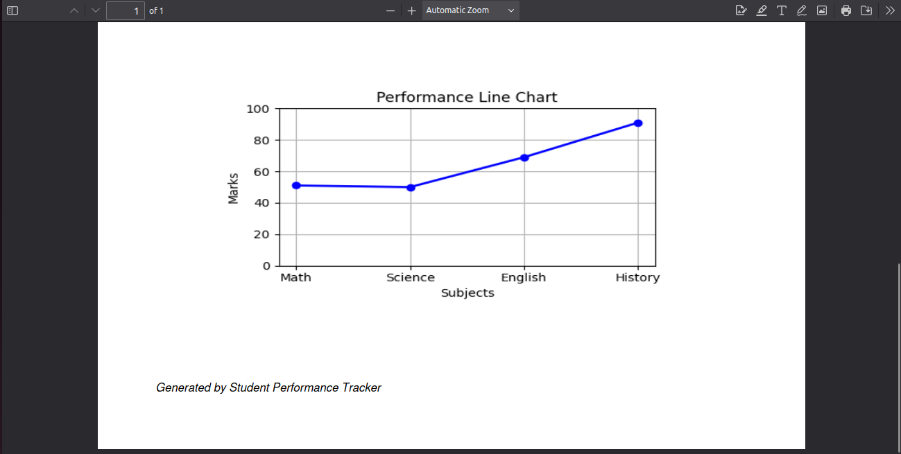
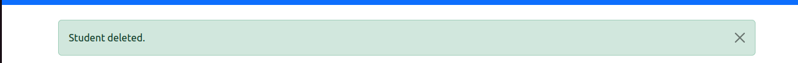
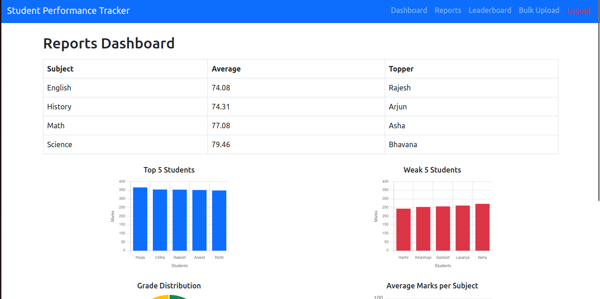
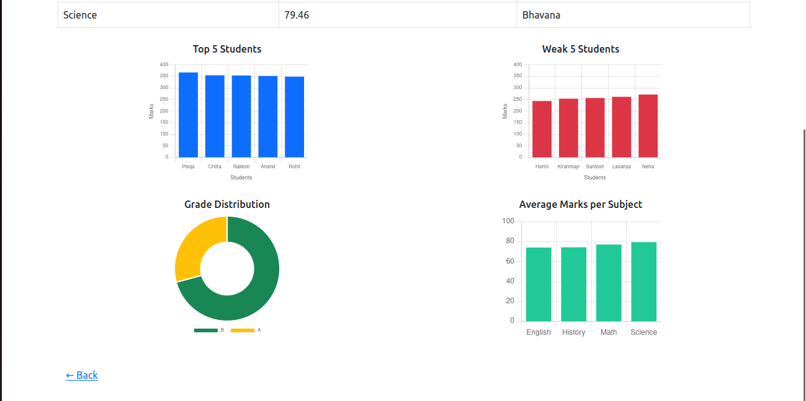
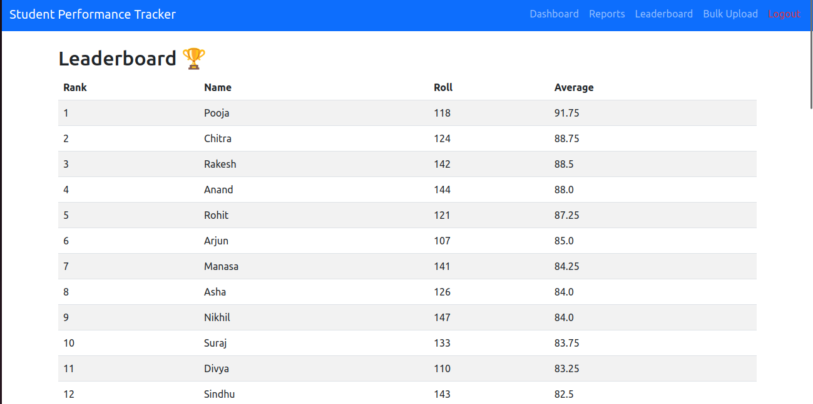

# 🎓 Student Performance Tracker

A Flask web app to manage and analyze student marks — view performance reports, leaderboards, and generate report cards with graphs.

## 🚀 Features
- Add, update, delete students  
- Add subjects & grades  
- Auto calculate averages and grade letters  
- Generate PDF report cards with line charts  
- Leaderboard & performance reports  
- Secure login system for teachers  

## 📸 Screenshots











## ⚙️ Installation
```bash
git clone https://github.com/yourusername/Student_Performance_Tracker.git
cd Student_Performance_Tracker
pip install -r requirements.txt
python run.py
